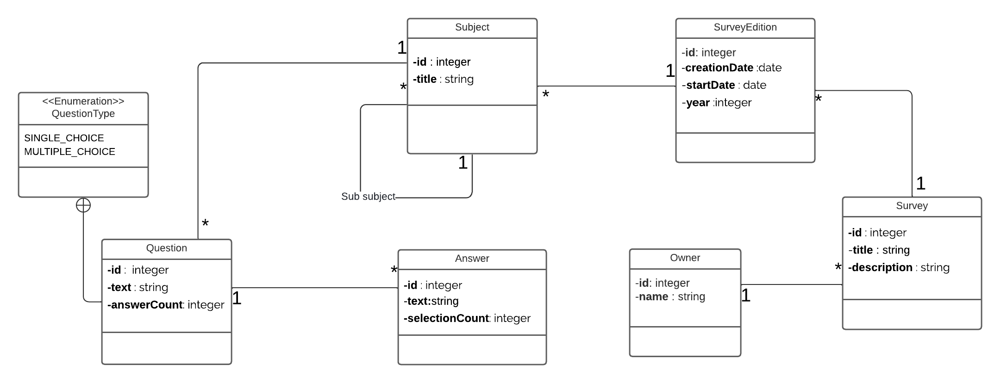

# State of dev 📊

A professional survey platform specialized for the IT industry, inspired by the StackOverflow Developer Survey. Built with Spring Boot and DDD principles.


## 📑 Table of Contents
- [Overview](#overview)
- [Architecture](#architecture)
- [Class Diagram](#class-diagram)
- [Tech Stack](#tech-stack)
- [Key Features](#key-features)
- [Getting Started](#getting-started)
- [Development](#development)
- [Testing](#testing)
- [API Documentation](#api-documentation)

## Overview

State of dev is a robust survey platform designed specifically for gathering insights from the IT industry. It provides hierarchical survey structuring with subjects and sub-subjects, supporting different types of questions and tracking answer statistics across yearly editions.

## Architecture

The project follows Domain-Driven Design (DDD) principles and is built using Spring Modulith for a modular monolith architecture.

### Bounded Contexts:
- Survey Management (Core Domain)
- Identity and Access (Supporting Domain)



## Tech Stack

### Core Technologies
- Java 21
- Spring Boot 3.2.0
- Spring Modulith
- Spring Cache with Redis
- PostgreSQL 16
- Redis 7.2
- Docker & Docker Compose

### Development Tools & Practices
- Test-Driven Development (TDD)
- Domain-Driven Design (DDD)
- Maven
- JUnit 5
- AssertJ

### API & Documentation
- OpenAPI 3.0
- Swagger UI

## Key Features

- 📊 Hierarchical survey structure
- 📅 Yearly survey editions
- 📋 Multiple question types (Single/Multiple choice)
- 📈 Answer statistics tracking
- 🔐 Secure owner authentication
- 📊 Analytics capabilities
- 🚀 Redis caching for improved performance

## Getting Started

### Prerequisites
- JDK 21
- Docker & Docker Compose
- Maven 3.8+

### Installation

1. Clone the repository
```bash
git clone https://github.com/yourusername/itlens.git
cd itlens
```

2. Start the PostgreSQL and Redis containers
```bash
docker-compose up -d
```

3. Build the application
```bash
./mvnw clean install
```

4. Run the application
```bash
./mvnw spring-boot:run
```

The application will be available at `http://localhost:8080`

## Development

### Project Structure
```
itlens/
├── src/
│   ├── main/
│   │   ├── java/
│   │   │   └── com/itlens/
│   │   │       ├── survey/
│   │   │       ├── identity/
│   │   │       └── analytics/
│   │   └── resources/
│   └── test/
└── docker/
```

### API Endpoints

#### Survey Management
```
# Surveys
GET    /api/v1/surveys                    # List all surveys
POST   /api/v1/surveys                    # Create new survey
GET    /api/v1/surveys/{id}               # Get survey by ID
PUT    /api/v1/surveys/{id}               # Update survey
DELETE /api/v1/surveys/{id}               # Delete survey

# Survey Editions
GET    /api/v1/surveys/{id}/editions      # List editions for survey
POST   /api/v1/surveys/{id}/editions      # Create new edition
GET    /api/v1/surveys/{id}/editions/{eid} # Get specific edition
PUT    /api/v1/surveys/{id}/editions/{eid} # Update edition
DELETE /api/v1/surveys/{id}/editions/{eid} # Delete edition

# Subjects
GET    /api/v1/subjects                   # List all subjects
POST   /api/v1/subjects                   # Create new subject
GET    /api/v1/subjects/{id}              # Get subject by ID
POST   /api/v1/subjects/{id}/sub-subjects # Create sub-subject
GET    /api/v1/subjects/{id}/questions    # List questions in subject

# Questions
POST   /api/v1/questions                  # Create question
PUT    /api/v1/questions/{id}             # Update question
DELETE /api/v1/questions/{id}             # Delete question
POST   /api/v1/questions/{id}/answers     # Add answer option
```

Example Request/Response:

```json
# POST /api/v1/surveys
Request:
{
    "title": "Developer Survey 2024",
    "description": "Annual developer survey to gather insights about IT industry trends"
}

Response:
{
    "id": 1,
    "title": "Developer Survey 2024",
    "description": "Annual developer survey to gather insights about IT industry trends",
    "createdAt": "2024-01-01T10:00:00Z",
    "status": "DRAFT"
}
```

### Caching Configuration

Redis is used to cache:
- Survey templates
- Active survey editions
- Frequently accessed subjects
- Answer statistics

Cache configuration example in application.yml:
```yaml
spring:
  cache:
    type: redis
    redis:
      time-to-live: 3600000
      cache-null-values: false
  redis:
    host: localhost
    port: 6379
```

## Testing

The project follows TDD practices:

```bash
# Run unit tests
./mvnw test

# Run integration tests
./mvnw verify -P integration-test
```

## API Documentation

Once the application is running, you can access:
- Swagger UI: `http://localhost:8080/swagger-ui.html`
